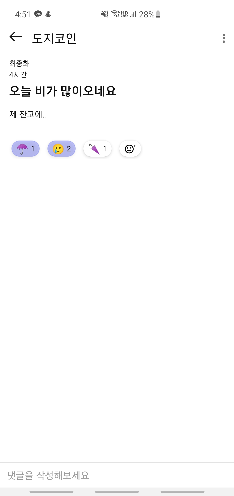
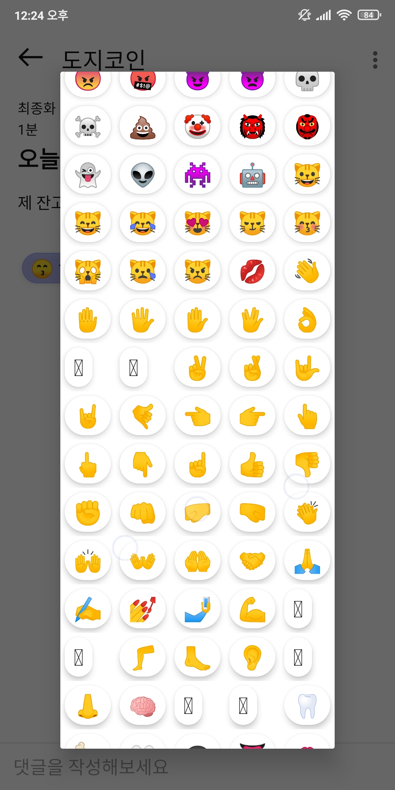
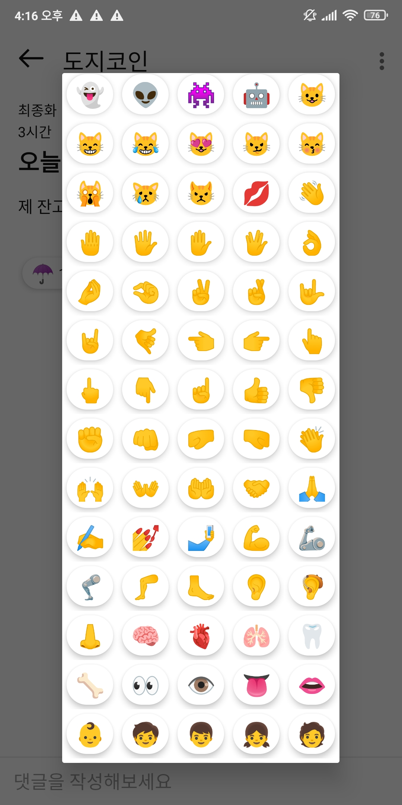

이 글은 안드로이드에서 새로 추가된 이모티콘을 표현하지 못하는 문제를 해결을 다루는 글입니다.


# 문제

종토방에서는 이모지를 통해서 게시글이나 댓글에 대해서 이모지를 통해 표현할 수 있는 기능을 제공하고 있습니다. 


{: width="50%" height="50%"}


현재 존재하는 이모지를 모두 표현을 해보았고, 제 테스트 기기(Galaxy S10 5G, Android 11)에서는 모든 이모지를 표현하고 있기에 별 문제가 없다 생각했습니다. 하지만 최신 버전이 아닌 안드로이드 기기를 사용하면서 알게 되었습니다. 과거 버전의 운영체제는 새로운 이모지를 표현하지 못한다는 것을… 


{: width="50%" height="50%"}


표현이 안되는 이모지는 ☐ 형식으로 표시되는 것을 볼수 있습니다.


이모지는 특정 유니코드조합이 하나의 이모지를 표현하는 것으로 정의 되어 있습니다. 그런데 유니코드를 해석하는 글꼴이 없다면, ☐ 형식으로 나타나게 되는 것 입니다. 


[여기](https://unicode.org/emoji/charts/emoji-versions.html)서 버전별 추가된 이모지를 확인하실수 있습니다


# 해결방법

그러면 어떻게 해결하느냐, 운영체제가 최신 버전의 유니코드 사양을 업그레이드 할때 까지 기다리는 방법도 있겠지만… 서비스를 제공하는 입장에서는 말도 안되는 방법입니다.

그래서 구글에서 [EmojiCompat](https://developer.android.com/guide/topics/ui/look-and-feel/emoji-compat?hl=ko)이라는 라이브러리를 만들어 주었습니다.


### EmojiCompat

EmojiCompat은 호환되는 글꼴을 미리 다운받아 최신버전의 유니코드 사양을 지원하여 이모지를 표현할 수 있는 라이브러리 입니다.


#### 라이브러리 종속성 추가

```
dependencies {
	...
	// emoji
  implementation 'androidx.emoji:emoji:1.2.0-alpha03'
  implementation 'androidx.emoji:emoji-bundled:1.2.0-alpha03'
}
```


#### 글꼴 초기화

```kotlin
import androidx.emoji.bundled.BundledEmojiCompatConfig
import androidx.emoji.text.EmojiCompat

class MyApplication : Application() {

    override fun onCreate() {
        super.onCreate()
      	val config = BundledEmojiCompatConfig(mContext).setReplaceAll(true)
      	EmojiCompat.init(config)
    }
}
```


#### 레이아웃 XML 위젯 적용

```xml
<androidx.emoji.widget.EmojiTextView
   android:layout_width="wrap_content"
   android:layout_height="wrap_content"/>
```


# 🎉 적용 성공

{: width="50%" height="50%"}

위와 같이 적용을 완료하면 모든 이모티콘이 정상적으로 표현되는 것을 확인할수 있습니다.

구글이 제공해준 라이브러리 덕분에 쉽게 해결할수 있었습니다 😆